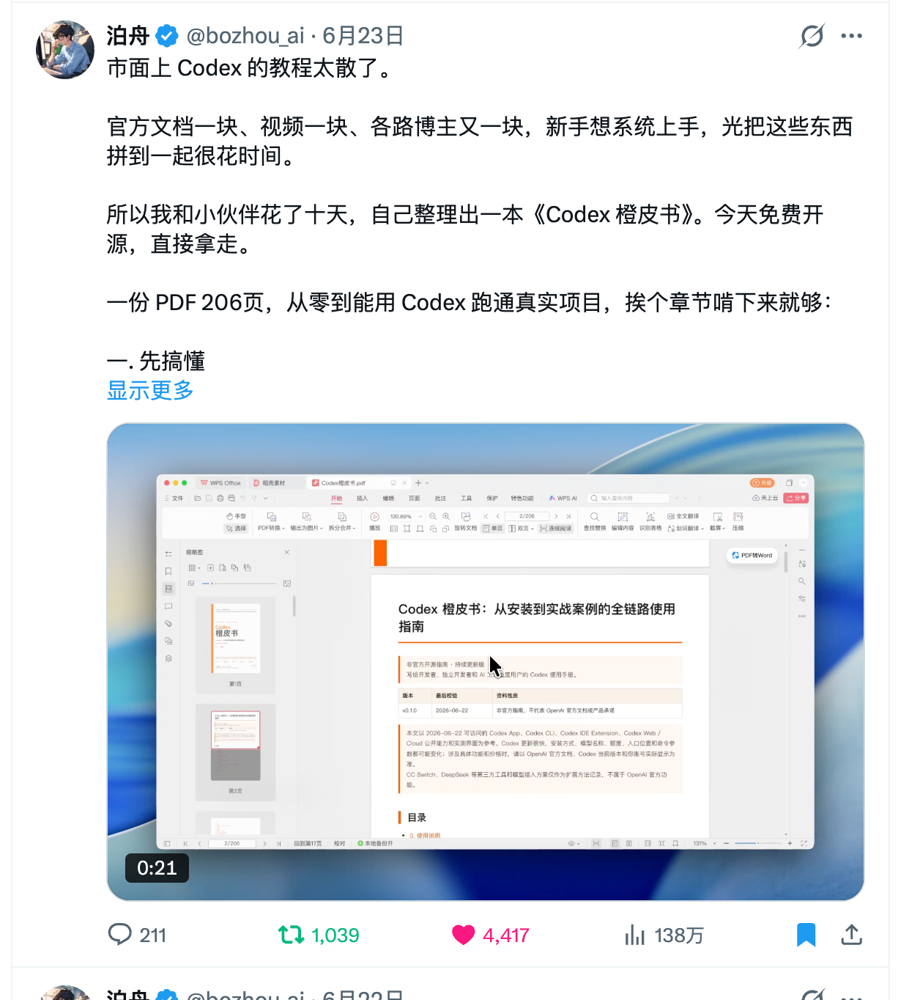
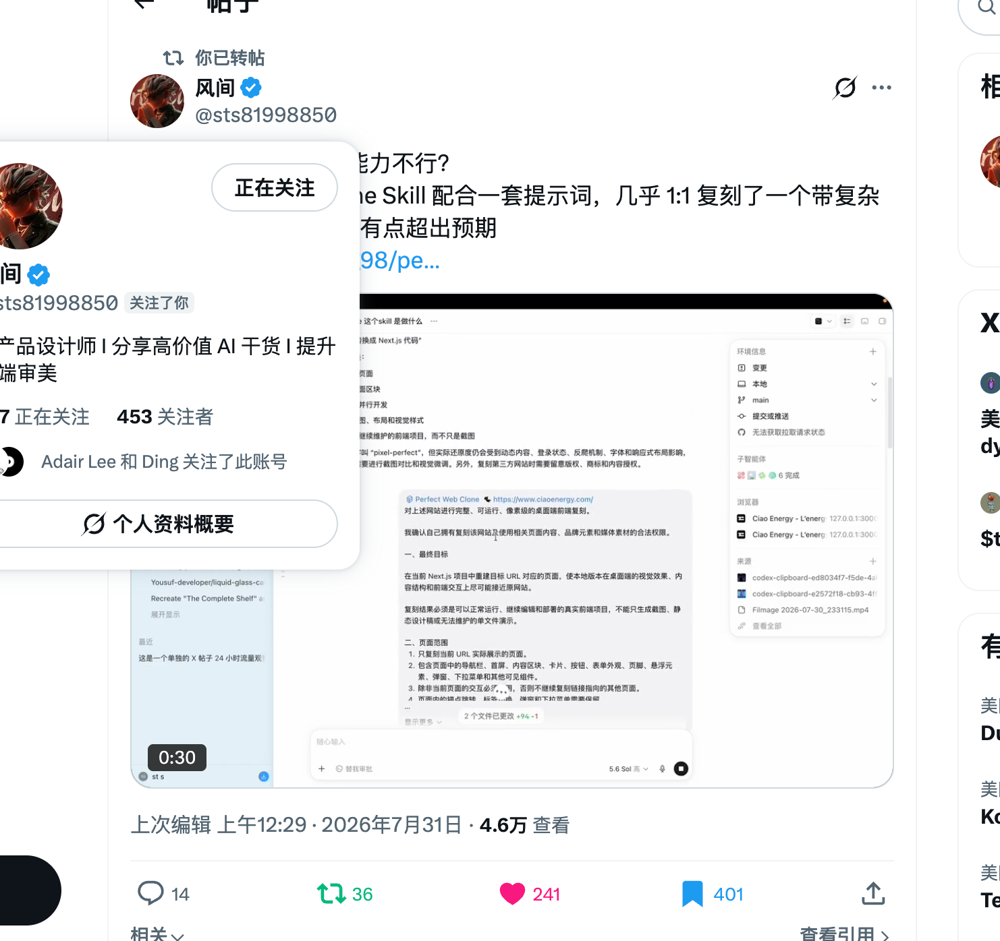
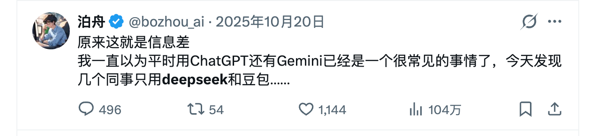

# 日常如何发帖

做 X 日常运营，先要想清楚一件事：一天要发多少条？

我觉得新手第一步应该考虑的，不是今天到底发什么，而是先给自己定一个数量目标。比如我刚起号的时候，每天给自己定的目标就是 25 条。

这里的 25 条，不是说一天要发 25 条原创帖子。自己发一条帖子、去别人评论区认真评论一次，或者引用一条帖子，我都会把它算作一条。

所以可以先定一个明确的目标。比如一天 20 条，定下来以后，再去考虑这 20 条具体怎么发。

## 主动发帖，最重要的是提供价值

我们自己主动发的帖子，最重要的一点就是：用户看完以后能够收获什么？

比如你整理了一份很好的资料，或者自己做了一个非常好用的 Skill。这个东西你自己用完都觉得很惊艳，确实帮你解决了一些问题，那就可以把它发出来。

别人看完以后，马上想收藏这个 Skill，或者拿走直接用，他就从你的帖子里获得了价值。自然而然会给你带来互动，甚至关注你。

所以我建议前期可以多整理一些干货资料，也可以多分享自己原创的 Skill、项目之类。对新账号来说，这些内容都很适合用来起号。

举个例子，我这一个获得138万浏览的一个帖子，就是我在大家都想学Codex的情况下，做了一个这样的零基础教程。所有的用户都可以在我这里拿到一份免费的PDF文档，照着这个进行学习。这样的话，我就给用户提供了很多价值。这一篇帖子给我涨粉4000左右。

## 选题从前面的信息源里来

评论大佬和引用帖子，在[如何和大 V 互动](../04-如何和大V互动/如何和大V互动.md)这一篇里已经讲过了，这里就不过多赘述。这里主要说的是，我们自己日常可以主动发什么。

内容来源其实就是前面提到的[信息源](../07-信息源怎么获取/信息源怎么获取.md)。先从信息源里筛选出好的信息，再从中挑选适合自己的选题，最后进行创作。

我觉得选题其实是发不完的。你可以让 AI 不停帮你搜集选题，存进自己的选题池里，然后持续筛选、创作、发出去。

## 低粉期没流量，先继续发

特别是前期粉丝比较少的时候，帖子发出去很容易没有流量。这时候不要想太多，最好的办法就是继续发，而且一定要先多发。

刚开始做自媒体的时候，我们是没有网感的。网感也不是想出来的，需要你不停发内容，也不停刷内容，慢慢练出来。

持续一段时间以后，你会越来越清楚：这条帖子能不能火？甚至还没有发出去，你大概就能预想到它会不会有流量。到了这个阶段，你的网感就开始形成了。

## 需要正反馈时，可以找大 V 帮忙

还有一种方法，就是找大 V 帮你转发或者引用。现在也有一些社群，可以付费请别人帮你引用、转发。

对于粉丝量很低的账号来说，如果有一个大 V 帮你转发，很快就能获取不少流量。这个方法确实能带来比较好的正反馈。

下面就是一个实际的案例，我给这位伙伴转帖之前，他其实粉丝量只有200不到。然后他平常发帖子都是100浏览左右。而我给帮他转发以后，并且我还评论了。这篇帖子本身也有价值，然后瞬间就直接跑出来了4.6万，是他流量最好的一个帖子

## 把爆款帖子收藏起来

看到爆款帖子要学会收藏。比如 X 上一些泛流量的内容，像去香港办卡、苹果美区账号开通，或者某个突然很火的话题，都可以先存下来。

因为在 X 上有一个很实用的经验：**火过的帖子，往往还会再火。**

别人发过而且很火的内容，过一两个月换成自己的角度重新做一遍，仍然可能会有不错的流量。这里同样说的是二创，不是把别人的原文直接搬过来。

打个比方，这个帖子是我之前看到一个大V他发过的帖子。然后他是每隔一两个月就会拿出来发一下，而且流量就会很大。当然也很明显，因为这个帖子是比较有争议性的一个话题。我们看整个评论数就知道，这种的话就会带来很大的泛流量。当我们看到有类似的这种爆款帖，我们可以收藏一下，当我们长期没有流量的时候，感觉被算法限制的时候，就可以拿出来用一用。

## 别只发专业内容

除了赛道里的内容，我们也可以发一些工作或生活上的吐槽，还有自己最近学习到的感悟。

这些内容会让你的账号更有活人感。有时候就是一句不经意的吐槽，反而会激起大家的共鸣，带来很大的流量。

我觉得完全可以把 X 当作朋友圈。除了知识分享和专业内容，也可以分享一些个人感悟和生活，让自己的形象和人设更立体。

## 我推荐的日常比例

我的建议是这样分配：

- **引用和评论：50%**
- **个人主动发帖：40%**
- **生活感悟和工作吐槽：10%**

比如一天发 20 条，也就是大概 10 条引用或评论、8 条自己主动发的专业内容，再加 2 条生活感悟或者工作吐槽。

这样基本就完成了日常发帖的全部内容。
